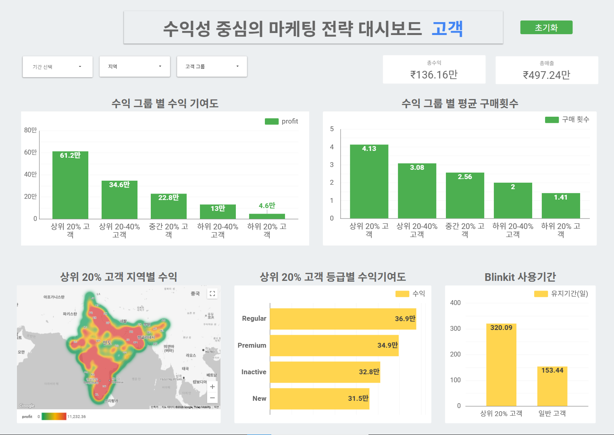
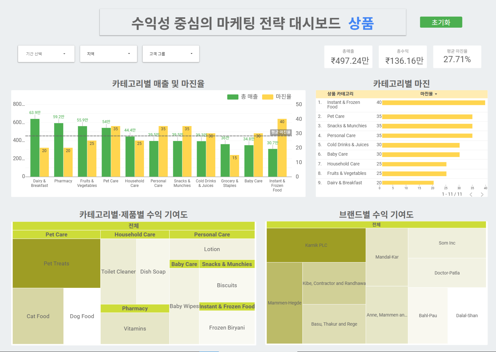
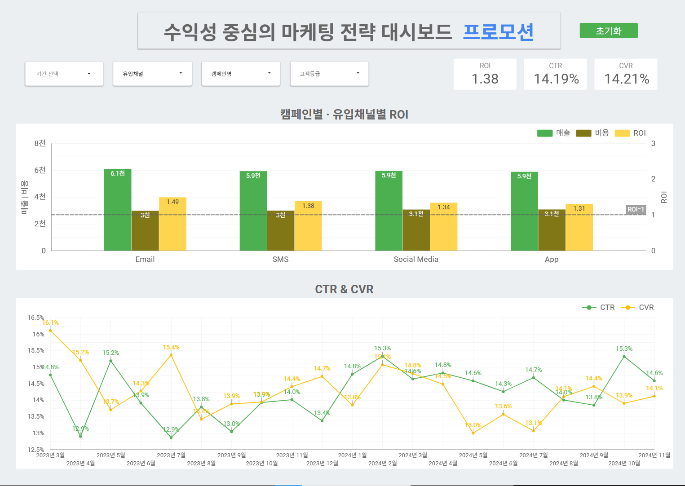

# Blinkit 수익성 중심 마케팅 전략 대시보드

> 이 프로젝트는 **Blinkit의 장기적 수익성 극대화를 위한 전략적 마케팅 방향 설정**을 위한 데이터 기반 대시보드입니다.  
> 고객(Customer), 상품(Product), 프로모션(Promotion) 3개의 영역을 중심으로 고수익 기여 요소를 식별하고, 마케팅 투자 효율성과 예산 분배 전략 수립에 기여합니다.

---

# [1] 프로젝트 개요

### 1. 분석 배경
- Blinkit은 현재 인도 퀵커머스 시장에서 약 40%의 독보적인 시장 점유율 1위를 차지하고 있음
- 이 확고한 시장 입지를 바탕으로, 장기적인 성장을 위해서는 신규 고객 유치보다는 고수익 고객 관리 및 제품/마케팅 효율화를 통해 수익성을 극대화하는 전략이 필수적일 것으로 사료됨


### 2. 분석 대상 : Blinkit 
### 3. 대상 청중 : Blinkit 경영진  
### 4. 분석 목적  
- 수익성 높은 고객, 제품, 마케팅 활동을 식별  
- 마케팅 ROI 및 고객 행동 기반의 전략적 인사이트 도출 위한 근거 제공 
- 예산의 효과적 재배분을 위한 근거 제공  

---

# [2] 분석 목표 및 핵심 KPI

## 1. 분석 목표  
- 고수익 고객군과 제품군 식별  
- 수익성 중심의 마케팅 전략 수립  
- 마케팅 캠페인 효율성 평가 및 예산 최적화  

## 2. 핵심 KPI
- 총매출  
- 총수익  
- 마진율  
- ROI (Return on Investment)  
- CTR (Click-Through Rate)  
- CVR (Conversion Rate)

---

## 3. 대시보드 구성

### (1) 고객 분석 (Customer)

- 수익 그룹별 수익 기여도 및 평균 구매횟수
- 상위 고객군의 등급/지역/사용기간 분석
- 고객 리텐션 전략 수립을 위한 핵심 데이터 제공

> **주요 의사결정 포인트**
- 어떤 고객군이 Blinkit의 핵심 수익을 주도하고 있는가?
- 고수익 고객은 어떤 등급과 지역에 집중되어 있는가?
- 평균 구매횟수나 사용 기간이 긴 충성 고객군은 누구인가?
- 고객 이탈 방지를 위해 어떤 타겟에게 리텐션 전략을 우선 적용해야 하는가?

> 

---

### (2) 상품 분석 (Product)

- 카테고리별 매출 및 마진율 비교
- 카테고리/제품/브랜드별 수익 기여도 분석
- 고마진 제품군 기반 프로모션 우선순위 도출

**주요 의사결정 포인트**
- 어떤 제품 카테고리가 높은 수익성과 마진율을 보이는가?
- 매출 대비 마진이 높은 제품군은 무엇이며 집중 대상인가?
- 수익 기여도가 높은 브랜드는 누구인가?
- 어떤 제품군을 중심으로 프로모션 전략을 강화해야 하는가?

> 

---

### (3) 프로모션 분석 (Promotion)

- 유입채널 및 캠페인별 매출, 비용, ROI 분석
- CTR, CVR 시계열 추이 분석
- ROI 높은 채널/캠페인 기반 예산 재배분 전략 제안

**주요 의사결정 포인트**
- 어떤 유입 채널/캠페인에서 ROI가 가장 높은가?
- ROI 기준으로 효율이 높은 캠페인은 무엇인가?
- ROI를 기준으로 효율이 높은 유입 채널은 무엇인가?
- CTR, CVR을 추이를 기반으로 성과가 저조한 시기는 언제인가?


> 

---

## 4. 사용 기술 및 도구

- **Data Platform** : Google Looker Studio  
- **Data Sources** : CSV files
- **Visualization** : 막대그래프, 트리맵, 히트맵, 시계열  
- **Preprocessing Tool** : Python, SQL
- **Versioning** : Git, GitHub

---

## 5. 프로젝트 구조
```
PJT3_blinkit
├── README.md
├── .gitignore
├── result
│ ├── Blinkit 대시보드 기획안.pdf
│ ├── Blinkit 대시보드 사용 가이드.pdf
│ ├── Blinkit 대시보드.pdf
│ ├── Blinkit 대시보드_최종수정본.pdf
│ ├── blinkit대시보드_고객.png
│ ├── blinkit대시보드_상품.png
│ └── blinkit대시보드_프로모션.png
├── data
│ ├── blinkit_customers.csv
│ ├── blinkit_marketing_performance.csv
│ ├── ...
│ └── top_categories.csv

```